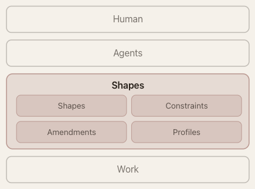

# Shapes

**Record the intent, constraints, and decisions that shape a project.**

## The Problem

Code tells you *what exists*. It doesn't tell you *why it was built that way*, *what must stay true*, or *what's explicitly out of scope*. That knowledge lives in engineers' heads, scattered across docs, Slack threads, and PR descriptions — if it's written down at all.

When an AI agent (or a new team member) starts working on a codebase, they reconstruct context from whatever artifacts they can find. They miss unwritten invariants, break architectural boundaries, and make changes that look correct in isolation but violate decisions the team made months ago.

Shapes makes that implicit knowledge explicit, queryable, and version-controlled — right alongside the code.

## What Shapes Does

Shapes creates a `.shapes/` directory in your project containing a structured graph of your project's intent and constraints, stored as plain YAML files. This graph is designed to be:

- **Queried on demand** by agents via CLI commands — not bulk-loaded into prompts
- **Version-controlled** alongside the code it describes
- **Inherited** — constraints propagate down the hierarchy, so you define a rule once and it applies everywhere it should

<p align="center">
  
</p>

Shapes sits between agents and the work they do. Before touching code, an agent queries the graph to discover what constraints apply, what the intent behind a component is, and what boundaries exist — then works within them.

## Core Concepts

### Shapes

A **Shape** is a node representing something being built: a system, service, feature, module, or pattern. Each shape carries structured intent — its goals, rationale, non-goals, and links to the source files that realize it.

```yaml
name: "Auth Service"
intent:
  kind: service
  summary: "JWT-based authentication"
  goals: "Stateless token validation with role-based access control"
  rationale: "Chose JWT over sessions to avoid server-side state"
  non_goals: "Not handling user registration — that's the Identity service"
constraints: [3, 7]       # constraint IDs that apply
parent: [1]               # inherits from the System shape
```

### Constraints

A **Constraint** is a rule that must hold — an invariant, requirement, boundary, guideline, or policy. Constraints have an enforcement mode (`machine` for automated checks, `manual` for human review) and describe what happens if violated.

```yaml
name: "No Direct DB Access from API Layer"
kind: invariant
rule: "API handlers must go through the service layer; no raw SQL in route files"
enforcement: manual
intent:
  rationale: "Prevents coupling API routes to schema details"
  impact_if_violated: "Schema migrations would require changing every route"
```

### Two DAGs

Shapes and constraints each form a **Directed Acyclic Graph** (DAG) — a hierarchy where nodes can have multiple parents.

- The **Shape DAG** represents composition: a System contains Services, which contain Features
- The **Constraint DAG** represents policy decomposition: broad policies break into specific rules

When you query "what constraints apply to this feature?", the system walks *up* the shape hierarchy, collecting all referenced constraints (including those inherited from parent shapes). You define a constraint once at the right level; it automatically applies to everything below.

### Profiles

A **Profile** defines the governance rules for your project — which intent fields are required vs. optional, what constraint kinds are allowed, and how the lifecycle works. Different projects need different fields; a Profile makes the protocol adapt to your domain.

## How It Works in Practice

**Without Shapes:** An agent is asked to refactor the auth module. It reads the code, sees an opportunity to simplify by moving token validation inline, and does it. The PR looks clean. But it broke an unwritten rule — token validation *must* go through the shared middleware so that audit logging is consistent. The team catches it in review, reverts, and re-explains the constraint.

**With Shapes:** The agent runs `shapes query constraints 5` on the auth shape, discovers the "Token Validation via Middleware" invariant, reads its rationale, and refactors around it. The constraint was discoverable before any code was changed.

## Quick Start

### Install the CLI

```bash
cargo install --git https://github.com/shapes-fyi/shapes
```

### Install the Claude Code skills

```bash
npx skills add shapes-fyi/shapes
```

### Use it

In any project, run `/shapes:init` in Claude Code. The agent will:

1. Explore your project structure and source code
2. Interview you about architecture, constraints, and domain knowledge
3. Create a Profile defining what fields matter for your project
4. Generate a context graph of shapes and constraints
5. Validate the graph and show you the result

After initialization, the agent automatically discovers and uses shapes context before doing any work.

Run `/shapes:maintain` periodically to audit the graph for consistency, duplicates, coverage gaps, and stale realizations.

## CLI Reference

```bash
shapes init                              # Create .shapes/ directory
shapes create shape --name "Auth" --kind service --summary "JWT auth service"
shapes create constraint --name "No DB in Auth" --kind invariant --rule "..."
shapes get shape 1                       # Read a node's full intent
shapes list shape --kind feature         # List with filters
shapes tree shape                        # ASCII DAG visualization
shapes query constraints 2              # All constraints (with inheritance)
shapes validate                          # Check graph integrity
```

Run `shapes --help` for the full command reference. Output formats: `--format yaml` (default) or `--format json`.

## Repository Structure

This is a monorepo containing:

- **`src/`** — `shapes-cli`, a Rust CLI to create and query the context graph
- **`apps/web/`** — the [shapes.fyi](https://shapes.fyi) specification website (TanStack Start, React 19, Vite)
- **`packages/ui/`** — shared UI component library (shadcn/ui, Base UI, Tailwind CSS v4)
- **`skills/`** — Claude Code skills (`/shapes:init`, `/shapes:context`, `/shapes:maintain`)
- **`.shapes/`** — the project's own context graph (shapes eating its own dog food)

## Development

### CLI

```bash
cargo build                # Build the CLI
cargo run -- --help        # Run locally
```

### Web

```bash
bun install               # Install dependencies
bun run dev               # Start dev server (port 3000)
bun run build             # Production build
bun run typecheck         # Type check all packages
bun run lint              # Lint all packages
bun run format            # Format with Prettier
```

## Learn More

- [Shapes Specification](https://shapes.fyi) — the Open Context Protocol specification
