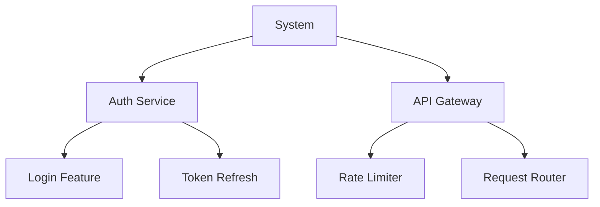
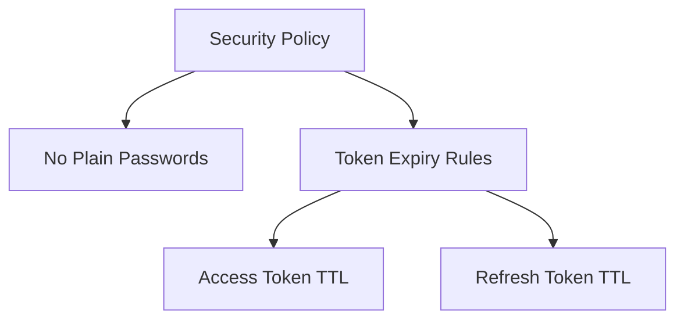
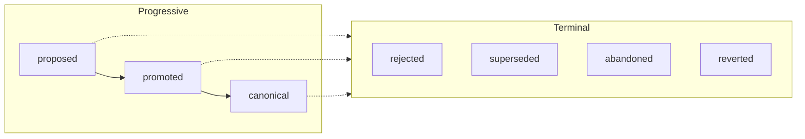

# Shapes

**Record the intent, constraints, and decisions that shape a project.**

Shapes captures what your code means — not just what it does — as a queryable graph of YAML files in a `.shapes/` directory, version-controlled alongside your code. Agents transcribe human intent into this context layer, query it before making changes, and maintain it as the project evolves.

<p align="center">
  
</p>

With Shapes, you can:

- **Give agents a queryable map of your project** — a structured graph of intent, constraints, and boundaries that agents consult *before* reading code, replacing expensive reconstruction from scattered artifacts
- **Enforce constraints through inheritance** — constraints propagate down the shape hierarchy, so agents discover every applicable rule automatically — not flat lists they might skip
- **Bound the scope of every change** — realizations link shapes to the artifacts that implement them, making scope explicit and surfacing changes that spill beyond it
- **Detect drift as code evolves** — audit the graph for stale bindings, coverage gaps, and divergence between intent and implementation
- **Work across any domain** — Profiles define custom vocabulary and lifecycles for software, research, writing, or any structured endeavor

Read the full specification at **[shapes.fyi](https://shapes.fyi)**.

## Why Shapes

The context an agent needs to understand your project is scattered across commit messages, PR descriptions, Slack threads, design docs, code comments, and people's heads. Reconstructing it from these sources is expensive, lossy, and doesn't scale.

- **Reconstruction doesn't scale** — An agent *could* query GitHub PRs, read commit histories, and grep through docs. In practice, this is extremely token-heavy and still produces fragments — not a coherent understanding of the project as a whole.
- **Agents have no map** — Without a structured context layer, agents plan and build by reading code. They miss intent they can't infer, constraints they can't see, and boundaries they can't derive. Every session starts from scratch.
- **Memory layers recall facts, not project structure** — Tools like Mem0, Zep, and Supermemory store entities and embeddings retrieved via semantic search. They help agents remember facts from past sessions, but don't model intent hierarchies, enforceable constraints, or change boundaries. They optimize for "recall what was said," not "understand the entire project."
- **Rules files are flat and unscopeable** — `CLAUDE.md` and similar files have no hierarchy, no inheritance, and no enforcement mechanism. A constraint that should govern an entire system must be restated everywhere, and nothing stops agents from overlooking it.
- **Recording history isn't structuring context** — Provenance-only tools like [Agent Trace](https://github.com/cursor/agent-trace) and [Entire](https://entire.io) capture agent sessions and traces but don't transform that history into a queryable layer. Knowing what happened is not the same as knowing what matters now, what rules apply, and what boundaries exist.

Shapes aggregates intent, constraints, and boundaries into a **single structured graph** that agents query *before* acting on code — an end-to-end map of the project that evolves alongside it.

## Table of Contents

- [Quick Start](#quick-start)
  - [Install the CLI](#install-the-cli)
  - [Install the Agent Skills](#install-the-agent-skills)
  - [Use It](#use-it)
- [Key Concepts](#key-concepts)
  - [Four Node Types](#four-node-types)
  - [Two DAGs](#two-dags)
  - [Intent: The Open Map](#intent-the-open-map)
  - [Constraint Inheritance](#constraint-inheritance)
  - [Lifecycle](#lifecycle)
  - [Profiles](#profiles)
- [Typical Workflow](#typical-workflow)
- [Commands Reference](#commands-reference)
- [Agent Skills](#agent-skills)
- [Discovery](#discovery)
- [Repository Structure](#repository-structure)
- [Getting Help](#getting-help)

## Quick Start

### Install the CLI

```bash
cargo install --git https://github.com/shapes-fyi/shapes
```

### Install the Agent Skills

```bash
npx skills add shapes-fyi/shapes
```

### Use It

The plugin provides three skills:

<table>
<tr><th>Skill</th><th>When to use</th></tr>
<tr><td nowrap><code>/shapes:shapes-init</code></td><td>Bootstrap shapes for a new project. Explores your codebase, interviews you about architecture and constraints, then generates a full context graph.</td></tr>
<tr><td nowrap><code>/shapes:shapes-context</code></td><td>Load the specification knowledge before working. Auto-loads when a <code>.shapes/</code> directory exists, or invoke manually to teach the agent the context-first workflow.</td></tr>
<tr><td nowrap><code>/shapes:shapes-maintain</code></td><td>Audit an existing graph. Run periodically to catch drift — stale realizations, coverage gaps, shallow nodes, and structural issues.</td></tr>
</table>

## Key Concepts

### Four Node Types

| Node | Purpose | Example |
| ---- | ------- | ------- |
| **Shape** | What to build and why | "Auth Service — JWT-based authentication with refresh token rotation" |
| **Constraint** | Rules that must hold | "No database queries in the auth module" |
| **Amendment** | Immutable change record | "Switched from session tokens to JWTs for compliance" |
| **Profile** | Governance configuration | Defines required fields, valid kinds, lifecycle gates |

### Two DAGs

Shapes maintains two independent directed acyclic graphs:

**Shape DAG (composition)**



**Constraint DAG (policy)**



**Shape DAG** — composition hierarchy. Systems contain services, services contain features. Each shape captures intent: what it does, why it exists, what it explicitly does *not* do.

**Constraint DAG** — policy decomposition. High-level policies break down into specific, enforceable rules. Shapes reference constraints by ID.

### Intent: The Open Map

Every node carries an **Intent** — a structured map with three required fields and unlimited domain-specific extensions:

```yaml
intent:
  kind: feature                    # domain label (free-form)
  summary: JWT token refresh       # human-readable description
  source: human                    # origin: human, ai, or system

  # Domain-specific extensions (defined by your Profile)
  goals: >-
    Seamless token renewal without forcing re-login
  non_goals: >-
    Does not handle initial authentication
  rationale: >-
    Refresh tokens reduce friction while maintaining security
```

Software teams add `goals`, `non_goals`, `rationale`, `failure_modes`. Research labs add `hypotheses`, `methodology`. Editorial teams add `themes`, `target_audience`. The Profile defines what fields exist.

### Constraint Inheritance

When an agent queries constraints for a shape, it gets constraints from **the shape itself and all its ancestors**:

```
shapes query constraints 5

# Returns:
# - Constraints directly on shape 5
# - Constraints on shape 5's parent
# - Constraints on the grandparent
# - ...all the way to the root
```

This means top-level rules automatically apply everywhere. A "no raw SQL" constraint on the system shape applies to every feature beneath it — agents discover this before writing code.

### Lifecycle

Nodes progress through **seven states** that control how they can change:



- **Proposed** — direct edits allowed, low confidence
- **Promoted** — changes require Amendments, increased confidence
- **Canonical** — changes require Amendments, authoritative
- **Terminal states** (rejected, superseded, abandoned, reverted) — immutable

### Profiles

Profiles make Shapes domain-agnostic. A Profile defines:

- **Custom Intent fields** — what metadata each node type carries (required vs optional)
- **Allowed kinds** — valid values for `intent.kind` (e.g., `feature`, `service`, `module`)
- **Lifecycle gates** — preconditions for state transitions
- **Amendment model** — how changes are applied (merge, overlay, append-only)

Each project has its own Profile. A game studio and a fintech company use the same specification with completely different vocabularies.

## Typical Workflow

### 1. Discover Context Before Working

```bash
shapes tree shape              # See the full project hierarchy
shapes get shape 3             # Read a specific shape's intent
shapes query constraints 3     # What rules apply here?
```

Agents follow this workflow automatically when the shapes skills are installed.

### 2. Create Shapes as You Build

```bash
shapes create shape \
  --name "Rate Limiter" \
  --kind feature \
  --summary "Token bucket rate limiting per API key"
```

Or write YAML directly — shapes are plain files in `.shapes/shapes/`.

### 3. Define Constraints

```bash
shapes create constraint \
  --name "No Unbounded Queues" \
  --kind invariant \
  --rule "Every queue must have a maximum size and a backpressure strategy"
```

### 4. Link Shapes to Code

Add **realization bindings** to connect shapes to the files that implement them:

```yaml
realization:
  - bindings:
      - scheme: path
        value: src/rate_limiter.rs
        metadata:
          summary: TokenBucket struct, per-key tracking, sliding window algorithm
    role: primary
```

### 5. Validate the Graph

```bash
shapes validate
```

Checks all 11 invariants: no cycles, no dangling references, reciprocal parent-child links, profile field requirements, and more. Exit code 0 if clean, 2 if issues found.

### 6. Maintain Over Time

Run `/shapes:shapes-maintain` to audit for drift — stale realizations pointing to renamed files, shallow nodes missing intent, coverage gaps where new code has no shapes.

## Commands Reference

| Command | Description |
| ------- | ----------- |
| `shapes init` | Create `.shapes/` directory with meta.yaml and subdirectories |
| `shapes create shape` | Create a Shape node (auto-assigned ID, starts as `proposed`) |
| `shapes create constraint` | Create a Constraint node |
| `shapes create amendment` | Create an Amendment targeting existing nodes |
| `shapes create profile` | Create a Profile for governance configuration |
| `shapes get shape <id>` | Read a shape's full definition (intent, constraints, realizations) |
| `shapes get constraint <id>` | Read a constraint's full definition |
| `shapes list` | List all nodes (optional filters: `--kind`, `--status`) |
| `shapes list shape` | List shapes only |
| `shapes tree shape` | Display Shape DAG as ASCII tree with inline constraints |
| `shapes tree constraint` | Display Constraint DAG as ASCII tree |
| `shapes query ancestors <id>` | Walk up the parent chain (BFS order) |
| `shapes query descendants <id>` | Walk down the child tree (BFS order) |
| `shapes query constraints <id>` | All effective constraints for a shape (including inherited) |
| `shapes validate` | Check both DAGs against all 11 invariants |

All commands support `--format yaml` (default) or `--format json`.

Run `shapes --help` or `shapes <command> --help` for full flag reference.

## Agent Skills

**shapes-init** is interactive. The agent explores your codebase, then interviews you in rounds covering purpose, architecture, constraints, domain knowledge, and project history. It creates a Profile, generates shapes and constraints, links them with realizations, and validates the result.

**shapes-context** teaches the agent the specification and the context-first workflow: run `shapes tree` to see the big picture, `shapes query constraints` to discover rules, and `shapes get` to read intent — before doing any work. Auto-loads when a `.shapes/` directory exists, or invoke manually with `/shapes:shapes-context`.

**shapes-maintain** catches drift. Files get renamed, features get removed, new modules appear. The maintain skill detects when shapes no longer match reality and helps you fix it.

## Discovery

Agents and tools can discover a Shapes graph through three mechanisms:

| Mechanism | How | Best For |
| --------- | --- | -------- |
| **Filesystem** | Walk up from CWD looking for `.shapes/` directory | Local CLI tools, IDE plugins |
| **MCP** | Advertise `shapes_discover` tool capability | AI agent integrations |
| **HTTP** | `GET /.well-known/shapes` (RFC 8615) | Web services, remote tools |

## Repository Structure

This is a monorepo containing:

- **`src/`** — `shapes-cli`, a Rust CLI to create and query the context graph
- **`spec/`** — the specification (operations, invariants, discovery)
- **`apps/web/`** — the [shapes.fyi](https://shapes.fyi) specification website (TanStack Start, React 19, Vite)
- **`packages/ui/`** — shared UI component library (shadcn/ui, Base UI, Tailwind CSS v4)
- **`skills/`** — agent skills (`/shapes:shapes-init`, `/shapes:shapes-context`, `/shapes:shapes-maintain`)
- **`.shapes/`** — the project's own context graph

## Getting Help

```bash
shapes --help              # General help
shapes <command> --help    # Command-specific help
```

- **Specification:** [shapes.fyi](https://shapes.fyi)
- **GitHub Issues:** [github.com/shapes-fyi/shapes/issues](https://github.com/shapes-fyi/shapes/issues)

