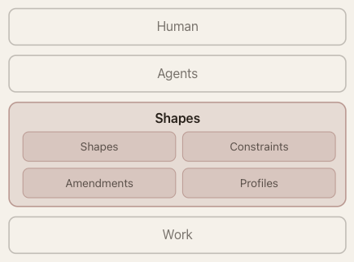
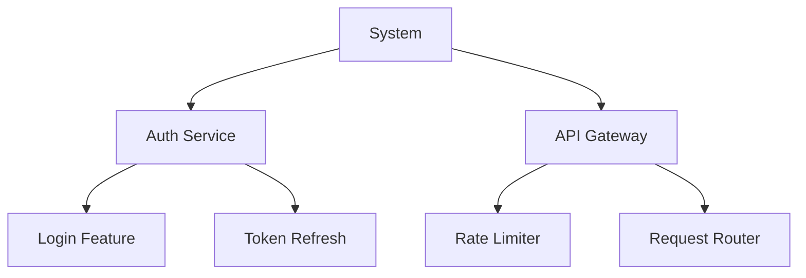
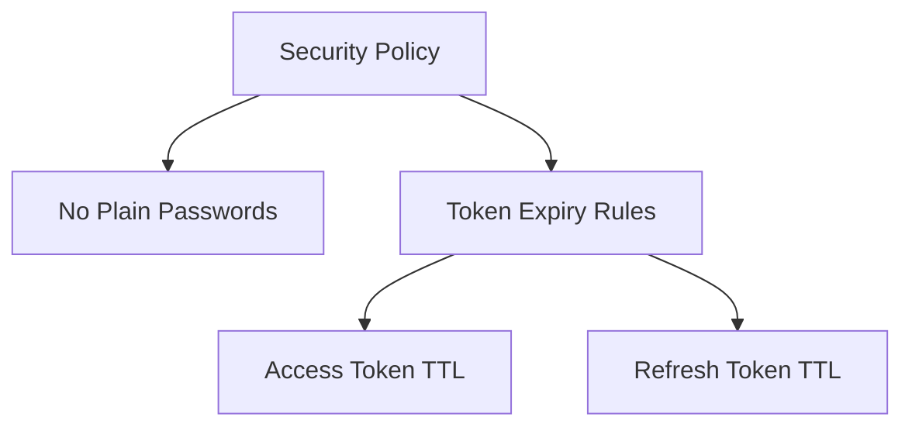
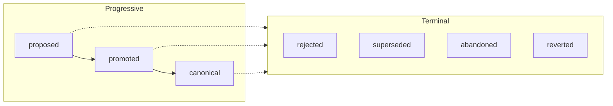

# Shapes

**Record the intent, constraints, and decisions that shape a project.**

Shapes captures what your code means — not just what it does — as a queryable graph of YAML files in a `.shapes/` directory, version-controlled alongside your code. Agents transcribe human intent into this context layer, query it before making changes, and maintain it as the project evolves.

<p align="center">
  
</p>

With Shapes, you can:

- **Give agents context they can't get from code** — intent, constraints, domain knowledge, and design rationale that would otherwise live in your head
- **Enforce rules through inheritance** — constraints propagate down the shape hierarchy, so agents discover what rules apply before writing code
- **Keep context accurate as code evolves** — audit the graph for drift, stale bindings, and coverage gaps
- **Stay domain-agnostic** — Profiles let you define custom vocabulary for software, research, writing, or any structured endeavor

Read the full specification at **[shapes.fyi](https://shapes.fyi)**.

## Table of Contents

- [Why Shapes](#why-shapes)
- [Quick Start](#quick-start)
  - [Install the CLI](#install-the-cli)
  - [Install the Agent Skills](#install-the-agent-skills)
  - [Use It](#use-it)
- [Key Concepts](#key-concepts)
  - [Four Node Types](#four-node-types)
  - [Two DAGs](#two-dags)
  - [Intent: The Open Map](#intent-the-open-map)
  - [Constraint Inheritance](#constraint-inheritance)
  - [Lifecycle](#lifecycle)
  - [Profiles](#profiles)
- [Typical Workflow](#typical-workflow)
- [Commands Reference](#commands-reference)
- [Agent Skills](#agent-skills)
- [Discovery](#discovery)
- [Repository Structure](#repository-structure)
- [Getting Help](#getting-help)

## Why Shapes

Code tells you *what* exists. Git tells you *what changed*. Neither tells you *why it matters*.

- **Intent lives in people's heads** — design rationale, unwritten rules, domain knowledge, and the reasoning behind architectural decisions are lost when the conversation ends.
- **Agents start from zero every time** — without structured context, agents reconstruct understanding from code alone, missing constraints they can't infer and intent they can't guess.
- **Constraints are scattered** — rules about what must hold live in docs, comments, code reviews, and tribal knowledge. No single place to query "what rules apply here?"
- **Context drifts silently** — as code evolves, the assumptions behind it become stale. There's no mechanism to detect when intent and implementation diverge.

Shapes solves this by making intent, constraints, and boundaries **explicit, queryable, and version-controlled**.

## Quick Start

### Install the CLI

```bash
cargo install --git https://github.com/shapes-fyi/shapes
```

### Install the Agent Skills

```bash
npx skills add shapes-fyi/shapes
```

### Use It

In any project, run `/shapes:shapes-init`. The agent will:

1. Explore your project structure and source code
2. Interview you about architecture, constraints, and domain knowledge
3. Create a Profile defining what fields matter for your project
4. Generate a context graph of shapes and constraints
5. Validate the graph and show you the result

After initialization, the agent automatically discovers and uses shapes context before doing any work.

Run `/shapes:shapes-maintain` periodically to audit the graph for consistency, duplicates, coverage gaps, and stale realizations.

## Key Concepts

### Four Node Types

| Node | Purpose | Example |
| ---- | ------- | ------- |
| **Shape** | What to build and why | "Auth Service — JWT-based authentication with refresh token rotation" |
| **Constraint** | Rules that must hold | "No database queries in the auth module" |
| **Amendment** | Immutable change record | "Switched from session tokens to JWTs for compliance" |
| **Profile** | Governance configuration | Defines required fields, valid kinds, lifecycle gates |

### Two DAGs

Shapes maintains two independent directed acyclic graphs:

**Shape DAG (composition)**



**Constraint DAG (policy)**



**Shape DAG** — composition hierarchy. Systems contain services, services contain features. Each shape captures intent: what it does, why it exists, what it explicitly does *not* do.

**Constraint DAG** — policy decomposition. High-level policies break down into specific, enforceable rules. Shapes reference constraints by ID.

### Intent: The Open Map

Every node carries an **Intent** — a structured map with three required fields and unlimited domain-specific extensions:

```yaml
intent:
  kind: feature                    # domain label (free-form)
  summary: JWT token refresh       # human-readable description
  source: human                    # origin: human, ai, or system

  # Domain-specific extensions (defined by your Profile)
  goals: >-
    Seamless token renewal without forcing re-login
  non_goals: >-
    Does not handle initial authentication
  rationale: >-
    Refresh tokens reduce friction while maintaining security
```

Software teams add `goals`, `non_goals`, `rationale`, `failure_modes`. Research labs add `hypotheses`, `methodology`. Editorial teams add `themes`, `target_audience`. The Profile defines what fields exist.

### Constraint Inheritance

When an agent queries constraints for a shape, it gets constraints from **the shape itself and all its ancestors**:

```
shapes query constraints 5

# Returns:
# - Constraints directly on shape 5
# - Constraints on shape 5's parent
# - Constraints on the grandparent
# - ...all the way to the root
```

This means top-level rules automatically apply everywhere. A "no raw SQL" constraint on the system shape applies to every feature beneath it — agents discover this before writing code.

### Lifecycle

Nodes progress through **seven states** that control how they can change:



- **Proposed** — direct edits allowed, low confidence
- **Promoted** — changes require Amendments, increased confidence
- **Canonical** — changes require Amendments, authoritative
- **Terminal states** (rejected, superseded, abandoned, reverted) — immutable

### Profiles

Profiles make Shapes domain-agnostic. A Profile defines:

- **Custom Intent fields** — what metadata each node type carries (required vs optional)
- **Allowed kinds** — valid values for `intent.kind` (e.g., `feature`, `service`, `module`)
- **Lifecycle gates** — preconditions for state transitions
- **Amendment model** — how changes are applied (merge, overlay, append-only)

Each project has its own Profile. A game studio and a fintech company use the same protocol with completely different vocabularies.

## Typical Workflow

### 1. Discover Context Before Working

```bash
shapes tree shape              # See the full project hierarchy
shapes get shape 3             # Read a specific shape's intent
shapes query constraints 3     # What rules apply here?
```

Agents follow this workflow automatically when the shapes skills are installed.

### 2. Create Shapes as You Build

```bash
shapes create shape \
  --name "Rate Limiter" \
  --kind feature \
  --summary "Token bucket rate limiting per API key"
```

Or write YAML directly — shapes are plain files in `.shapes/shapes/`.

### 3. Define Constraints

```bash
shapes create constraint \
  --name "No Unbounded Queues" \
  --kind invariant \
  --rule "Every queue must have a maximum size and a backpressure strategy"
```

### 4. Link Shapes to Code

Add **realization bindings** to connect shapes to the files that implement them:

```yaml
realization:
  - bindings:
      - scheme: path
        value: src/rate_limiter.rs
        metadata:
          summary: TokenBucket struct, per-key tracking, sliding window algorithm
    role: primary
```

### 5. Validate the Graph

```bash
shapes validate
```

Checks all 11 invariants: no cycles, no dangling references, reciprocal parent-child links, profile field requirements, and more. Exit code 0 if clean, 2 if issues found.

### 6. Maintain Over Time

Run `/shapes:shapes-maintain` to audit for drift — stale realizations pointing to renamed files, shallow nodes missing intent, coverage gaps where new code has no shapes.

## Commands Reference

| Command | Description |
| ------- | ----------- |
| `shapes init` | Create `.shapes/` directory with meta.yaml and subdirectories |
| `shapes create shape` | Create a Shape node (auto-assigned ID, starts as `proposed`) |
| `shapes create constraint` | Create a Constraint node |
| `shapes create amendment` | Create an Amendment targeting existing nodes |
| `shapes create profile` | Create a Profile for governance configuration |
| `shapes get shape <id>` | Read a shape's full definition (intent, constraints, realizations) |
| `shapes get constraint <id>` | Read a constraint's full definition |
| `shapes list` | List all nodes (optional filters: `--kind`, `--status`) |
| `shapes list shape` | List shapes only |
| `shapes tree shape` | Display Shape DAG as ASCII tree with inline constraints |
| `shapes tree constraint` | Display Constraint DAG as ASCII tree |
| `shapes query ancestors <id>` | Walk up the parent chain (BFS order) |
| `shapes query descendants <id>` | Walk down the child tree (BFS order) |
| `shapes query constraints <id>` | All effective constraints for a shape (including inherited) |
| `shapes validate` | Check both DAGs against all 11 invariants |

All commands support `--format yaml` (default) or `--format json`.

Run `shapes --help` or `shapes <command> --help` for full flag reference.

## Agent Skills

The shapes plugin includes three skills that any compatible agent can use:

| Skill | Invocation | Purpose |
| ----- | ---------- | ------- |
| **shapes-context** | Auto-loaded | Activates when `.shapes/` exists. Teaches the agent protocol concepts and the context-first workflow |
| **shapes-init** | `/shapes:shapes-init` | Bootstraps shapes for a new project through code analysis and engineer interview |
| **shapes-maintain** | `/shapes:shapes-maintain` | Audits the graph for consistency, coverage gaps, stale realizations, and structural issues |

**shapes-context** loads automatically — no action needed. When a project has a `.shapes/` directory, the agent learns to run `shapes tree` before working, `shapes query constraints` before writing code, and `shapes get` to understand intent.

**shapes-init** is interactive. The agent explores your codebase, then interviews you in rounds covering purpose, architecture, constraints, domain knowledge, and project history. It creates a Profile, generates shapes and constraints, links them with realizations, and validates the result.

**shapes-maintain** catches drift. Files get renamed, features get removed, new modules appear. The maintain skill detects when shapes no longer match reality and helps you fix it.

## Discovery

Agents and tools can discover a Shapes graph through three mechanisms:

| Mechanism | How | Best For |
| --------- | --- | -------- |
| **Filesystem** | Walk up from CWD looking for `.shapes/` directory | Local CLI tools, IDE plugins |
| **MCP** | Advertise `shapes_discover` tool capability | AI agent integrations |
| **HTTP** | `GET /.well-known/shapes` (RFC 8615) | Web services, remote tools |

## Repository Structure

This is a monorepo containing:

- **`src/`** — `shapes-cli`, a Rust CLI to create and query the context graph
- **`spec/`** — the protocol specification (protocol, operations, invariants, discovery)
- **`apps/web/`** — the [shapes.fyi](https://shapes.fyi) specification website (TanStack Start, React 19, Vite)
- **`packages/ui/`** — shared UI component library (shadcn/ui, Base UI, Tailwind CSS v4)
- **`skills/`** — agent skills (`/shapes:shapes-init`, `/shapes:shapes-context`, `/shapes:shapes-maintain`)
- **`.shapes/`** — the project's own context graph

## Getting Help

```bash
shapes --help              # General help
shapes <command> --help    # Command-specific help
```

- **Specification:** [shapes.fyi](https://shapes.fyi)
- **GitHub Issues:** [github.com/shapes-fyi/shapes/issues](https://github.com/shapes-fyi/shapes/issues)

